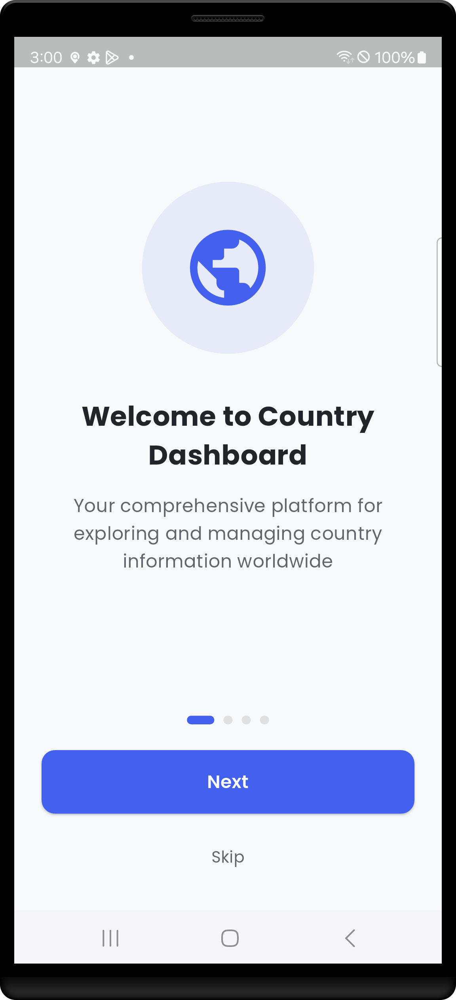
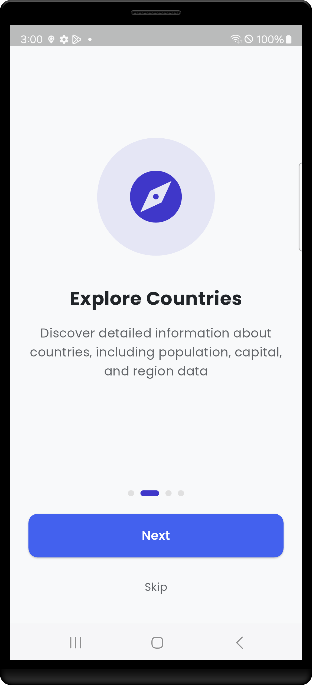
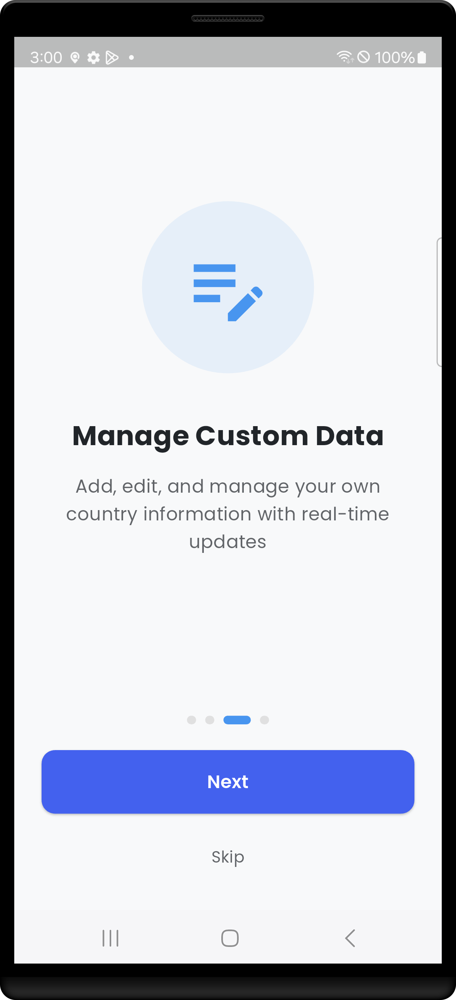
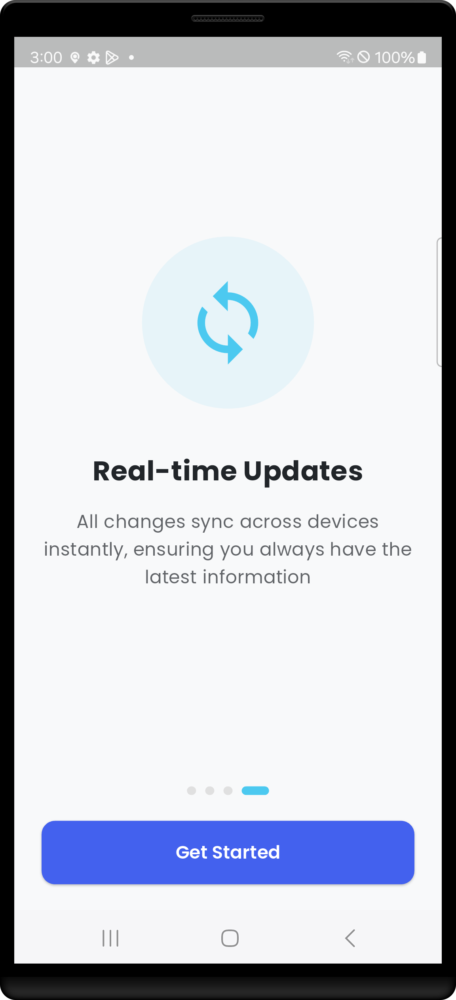
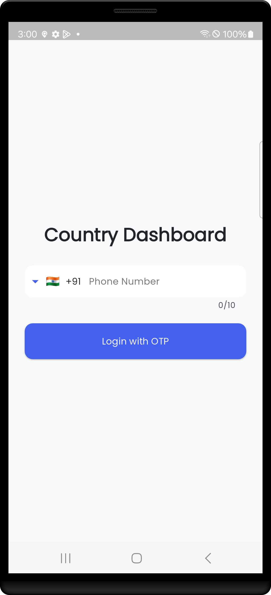
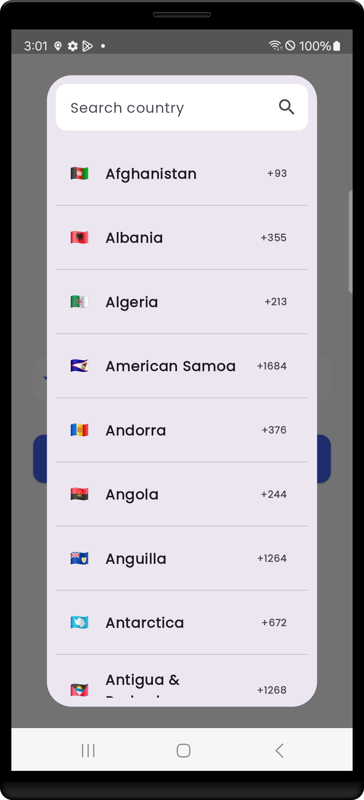
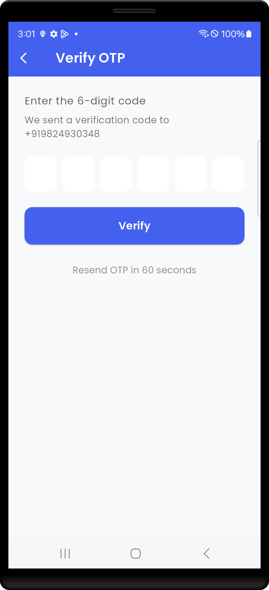
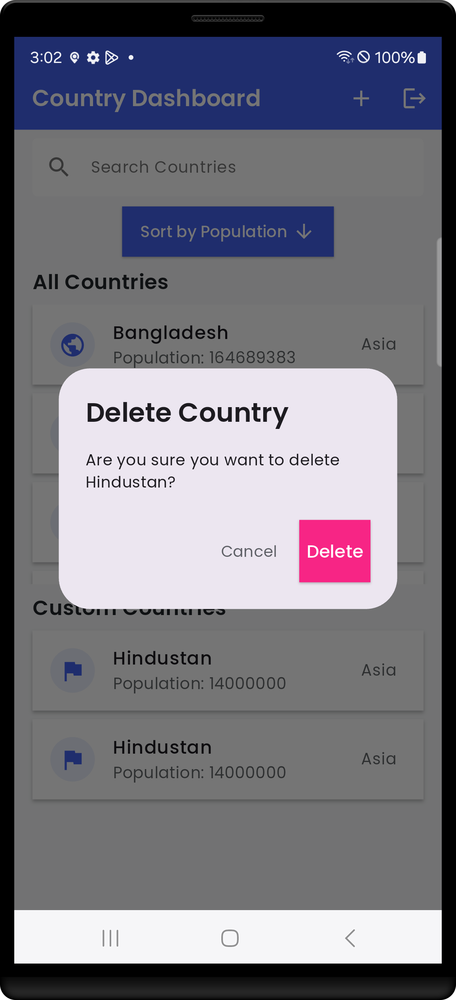
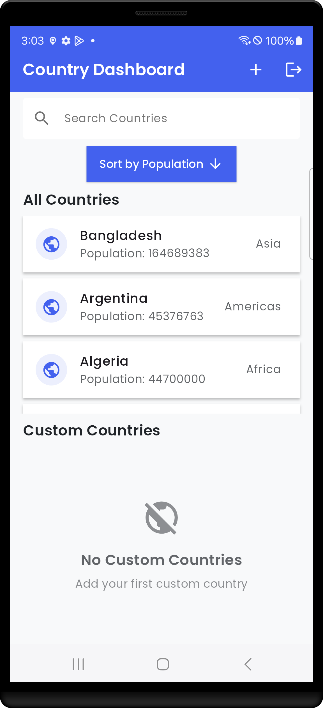
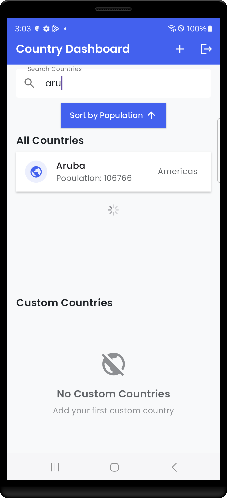

# Country Dashboard App

A modern Flutter application that provides a comprehensive dashboard for exploring country information. The app features real-time data from the REST Countries API, custom country management, and a beautiful user interface.

## 🌟 Features

- 📱 Modern and responsive UI design
- 🔍 Real-time country data from REST Countries API
- ➕ Add and manage custom countries
- 🔄 Sort countries by population
- 🔎 Search functionality
- 🌙 Dark mode support
- 📊 Detailed country information
- 🔐 Phone number authentication
- 💾 Firestore integration for custom countries

## 📸 Screenshots

<div style="display: flex; justify-content: space-between; margin: 20px 0;">
  
  
  
</div>

<div style="display: flex; justify-content: space-between; margin: 20px 0;">
  
  
  
</div>

<div style="display: flex; justify-content: space-between; margin: 20px 0;">
  
  
  
</div>

<div style="display: flex; justify-content: space-between; margin: 20px 0;">
  
 
</div>

## 🚀 Getting Started

### Prerequisites

- Flutter SDK (latest version)
- Dart SDK (latest version)
- Firebase project
- Android Studio / VS Code

### Installation

1. Clone the repository:
```bash
git clone https://github.com/yourusername/country_dashboard.git
```

2. Install dependencies:
```bash
flutter pub get
```

3. Configure Firebase:
   - Create a new Firebase project
   - Add your Android and iOS apps
   - Download and add the configuration files
   - Enable Phone Authentication in Firebase Console

4. Run the app:
```bash
flutter run
```

## 🛠️ Built With

- [Flutter](https://flutter.dev/) - UI framework
- [GetX](https://pub.dev/packages/get) - State management
- [Firebase](https://firebase.google.com/) - Backend services
- [REST Countries API](https://restcountries.com/) - Country data
- [Google Fonts](https://fonts.google.com/) - Typography
- [Flutter ScreenUtil](https://pub.dev/packages/flutter_screenutil) - Responsive UI

## 📱 Supported Platforms

- Android
- iOS
- Web (responsive)

## 🔐 Authentication

The app uses Firebase Phone Authentication for secure user access:
1. Enter phone number
2. Receive OTP
3. Verify OTP
4. Access dashboard

## 🌐 API Integration

The app fetches country data from the REST Countries API, including:
- Country names
- Capitals
- Regions
- Population
- Languages
- Flags

## 💾 Data Management

- Real-time data synchronization with Firestore
- Offline support for custom countries
- Efficient data caching
- Pagination for large datasets

## 🎨 UI/UX Features

- Material Design 3
- Responsive layout
- Dark/Light theme
- Smooth animations
- Error handling
- Loading states
- Pull-to-refresh
- Infinite scroll

## 📦 Project Structure

```
lib/
├── controllers/
│   ├── auth_controller.dart
│   ├── country_controller.dart
│   └── firestore_controller.dart
├── models/
│   ├── country_model.dart
│   └── custom_country_model.dart
├── services/
│   └── api_service.dart
├── utils/
│   └── theme.dart
└── views/
    ├── auth/
    │   ├── login_screen.dart
    │   └── otp_screen.dart
    └── dashboard/
        ├── add_country_screen.dart
        ├── country_detail_screen.dart
        └── dashboard_screen.dart
```

## 🤝 Contributing

1. Fork the repository
2. Create your feature branch (`git checkout -b feature/AmazingFeature`)
3. Commit your changes (`git commit -m 'Add some AmazingFeature'`)
4. Push to the branch (`git push origin feature/AmazingFeature`)
5. Open a Pull Request

## 📄 License

This project is licensed under the MIT License - see the [LICENSE](LICENSE) file for details.

## 👏 Acknowledgments

- REST Countries API for providing country data
- Firebase for authentication and database
- Flutter community for amazing packages
- All contributors who have helped this project grow

## 📞 Support

For support, email support@countrydashboard.com or open an issue in the repository.

## 🎥 Demo

Key Features Showcased:
- OTP Authentication flow
- Real-time search filtering
- Firestore CRUD operations

## 🏗 Architecture Diagram

```mermaid
graph TD
    A[UI Layer] -->|Calls| B[Controller]
    B -->|Manages| C[Services]
    C -->|Fetch Data| D[Firebase/Firestore]
    C -->|API Calls| E[REST Countries]
    D -->|Updates| B
    E -->|Returns Data| B
    B -->|Updates| A

